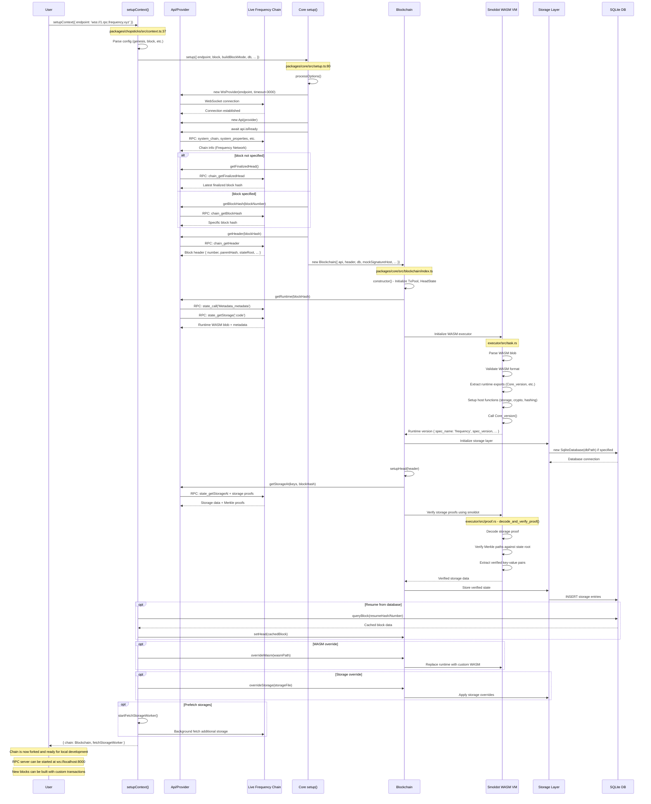

# Chopsticks Frequency Chain Fork - Sequence Diagram

Based on the analysis of the Chopsticks codebase, here's what happens when forking the Frequency chain using `setupContext`:

## Key Points

1. **Initial Connection**: Creates WebSocket connection to live Frequency chain
2. **Block Selection**: Either uses latest finalized block or specified block number/hash  
3. **Runtime Download**: Fetches the actual Frequency runtime WASM blob from `:code` storage
4. **Smoldot Integration**: Uses smoldot to parse WASM, setup VM, and verify storage proofs
5. **State Verification**: All storage data is cryptographically verified against the state root
6. **Local Setup**: Creates local blockchain instance with verified state and runtime
7. **Database Caching**: Optionally persists state to SQLite for faster subsequent runs

The result is a local fork that executes with **identical runtime logic** to the live Frequency chain, allowing realistic development and testing.